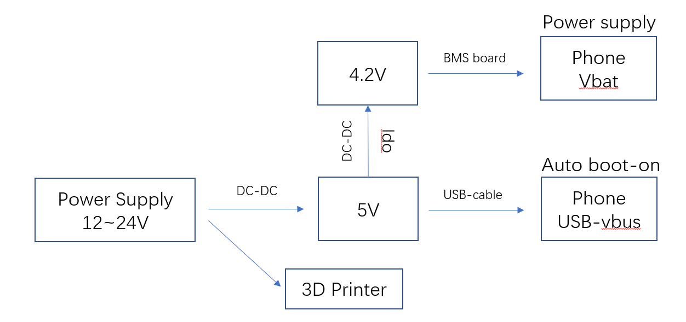
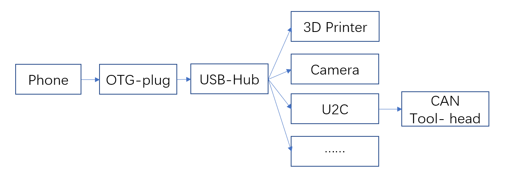
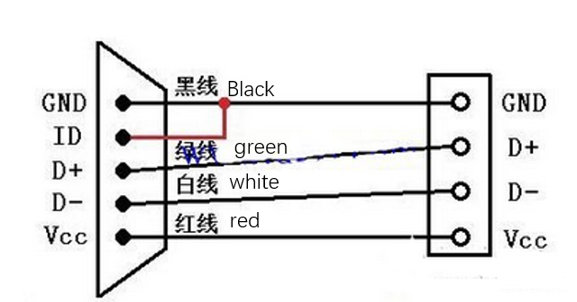

# Overview
[中文文档](./README_CN.md)

Here are some direct power supply modification solutions for commonly used models for your reference. In addition to using a PCB for modification, you can also modify your phone based on some basic principles.

- Disassemble your battery, remove the battery protection board, take out the battery cell, and input 4.2V or 5V DC into the protection board. Replace the battery cell with it.
- Insert the OTG plug into the phone's tail plug, enabling the phone's USB host mode.
- Input 5V DC into the phone's tail plug USB, and the phone will automatically turn on from the shutdown state.

- The phone using USB-otg wire to connecting 3D printers, and other tools and toolheads.

# Some Details
- 💡The reliable grounding of the electrical system🔌in a 3D printer is an essential prerequisite for ensuring stable and dependable operation.
- Ensure that your phone's power system is grounded with the printer motherboard, and it's preferable to provide power to the mobile system through a SMPS(Switch Mode Power Supply). Using the motherboard's fan interface for your phone's power supply may lead to issues.
- Redmi 2 requires the recognition of a genuine battery charging chip to work properly. Otherwise, it cannot correctly detect USB devices after booting.
- For models using the Qualcomm 625 CPU, inputting 4.7V directly into the Vbat contact on the phone's motherboard can work normally without using a battery protection board.Vbat and Vusb must not be directly connected! Ensure that `Vbat < Vusb`.
- The OTG function is implemented by recognizing the `id pin` in micro-USB or the `cc pin` in Type-C. If the phone cannot recognize it, check the connection method of the `id pin` or `cc pin`. Failure to enter OTG mode correctly will result in no output feedback under the `lsusb` command.
- Keep the USB signal lines as short as possible, wind the D+ and D- together, and use wires with shielding nets and shielding rings. Otherwise, unstable connections and disconnections may occur.

