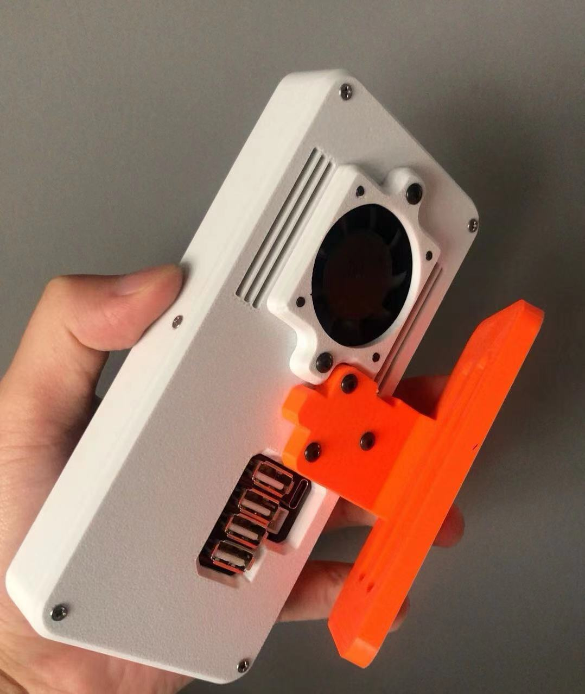

# KlipperPhonesLinux
[中文文档](./README_CN.md)

Turning your old phones into high-performance Klipper machine host running on Linux!

## Supported Models
- Xiaomi Redmi 2 (wt88047)
- Xiaomi Redmi 5 Plus (xiaomi-vince)
- Xiaomi Mi 5X (xiaomi-tissot)
- Xiaomi Mi A1 (xiaomi-tissot)
- Xiaomi Mi A2 Lite (xiaomi-daisy)
- Xiaomi Redmi 6 Pro (xiaomi-daisy)
- Xiaomi Redmi 4 Prime (xiaomi-markw)
- Xiaomi Redmi 5 Plus (xiaomi-vince)
- Xiaomi Redmi Note 4 (xiaomi-mido)
- Xiaomi Redmi S2 (xiaomi-ysl)
- Xiaomi Redmi Y2 (xiaomi-ysl)
- Xiaomi Redmi 4x (xiaomi-santoni)
- Xiaomi Note 2 (xiaomi-scopito)

## Flashing Instructions:
- [Xiaomi Redmi 2]()
- [Qualcomm 625 Models](https://github.com/umeiko/lk2nd/releases/tag/625_Flasher)
- [Xiaomi Note 2]()
- [Xiaomi Redmi 4x]()

## Quick Start After Flashing
- Connect to the terminal
  - Using the network (recommended)
    - Connect to your local network with KlipperScreen
    - Enter your phone's IP address in a web browser with port 8888, e.g., `192.168.31.124:8888`
  - Using USB serial
    - Connect your phone to your computer with a USB cable; your computer will recognize it as a serial device.
    - Use `PuTTY` or other terminal software to access the terminal console.

- Connect to your 3D printer motherboard using an OTG adapter
  - In the command line, use the `lsusb` command to ensure the system recognizes your 3D printer motherboard.
    - Common motherboards will be displayed as `Qingheng`, `OpenMoko xxx`, etc.
    - If not recognized, check your cable connections.
  - Install Klipper firmware for your 3D printer motherboard.
    - Install cross-compiler

          sudo apt update
          sudo apt install avrdude gcc-avr binutils-avr avr-libc stm32flash libnewlib-arm-none-eabi gcc-arm-none-eabi binutils-arm-none-eabi pkg-config

    - Refer to [Klipper documentation](https://www.klipper3d.org/Installation.html) to compile and install Klipper firmware for your motherboard.

- Configure the 3D printer's configuration file
  - Obtain the configuration file from your printer motherboard supplier or find it in the [Klipper repository](https://github.com/Klipper3d/klipper/tree/master/config).
  - Open the `Fluidd` interface, accessible through a web browser at `your phone's IP address`.
  - In the `Config` tab on the right, rename your motherboard configuration file to `printer.cfg` and overwrite the original file.
  - At the end of `printer.cfg`, add `[include fluidd.cfg]`.

- Now you have completed the basic configuration. Enjoy!

## Convert Your Phone to DC Power Supply ( PCB )

- Xiaomi Redmi 2 (wt88047)
- Xiaomi Redmi Note 4 (xiaomi-mido)
- Xiaomi Redmi 4 Prime(xiaomi-markw)
- Xiaomi Redmi 4x (xiaomi-santoni)

## Common Issues and Solutions:
- Enabling and configuring CAN
- Error during homing, 'timer too close'
- `lsusb` shows no reaction
- rotate the screen